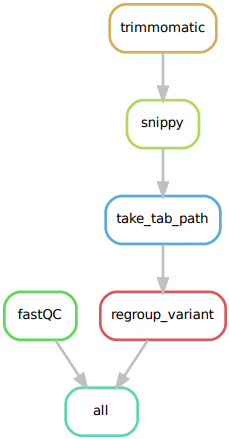

# Whole Genome Sequencing pipeline
Assemble bacterial genome and make variants call.

## Description

This project contains two major pipelines handled by Snakemake :
* A de novo bacterial genome assembler coupled with gene annotation design for paired end reads.

<p align="center"></p>

* A pipeline for variant calling by comparing against a reference genome. It's design for paired end reads. Can be used with a metadata file listing the different bacterial strains used and the experimental conditions to regroup output (ex : `variant_calling/metadata.csv`).

<p align="center"></p>

## Installation

### Source

Install the latest version of WGS pipeline in your directory.

```
git clone https://github.com/BAoBAb-biofilm/BAoBAb.git
```

### Softs used

Soft|Version
---------|------------
[Bakta](https://github.com/oschwengers/bakta) | 1.8.2
[fastp](https://github.com/OpenGene/fastp) | 0.23.4
[Quast](https://quast.sourceforge.net/) | 5.2.0
[Unicycler](https://github.com/rrwick/Unicycler) | 0.5.0
[Snippy](https://github.com/tseemann/snippy) | 4.6.0

## Usage

You need to do few steps to start using the two pipelines.

1. Database installation
 
2. Config samples and tools
